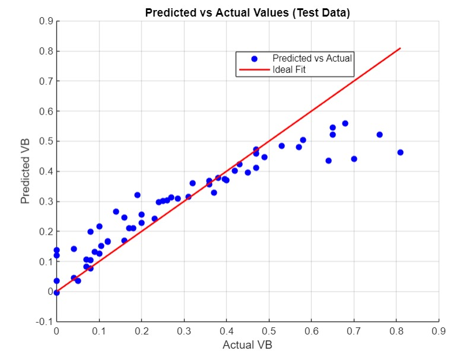
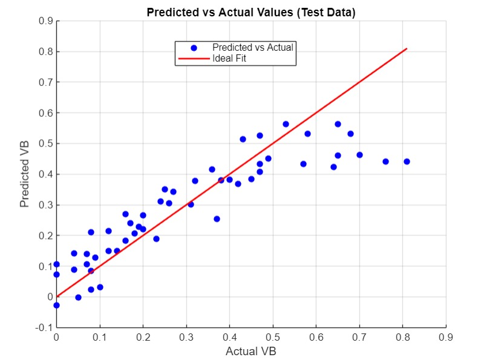
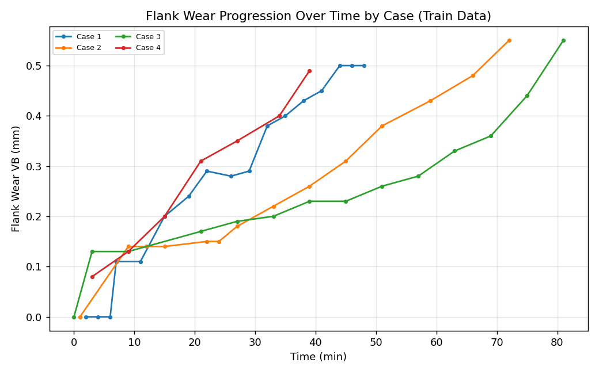
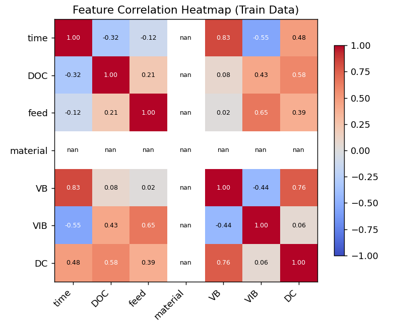
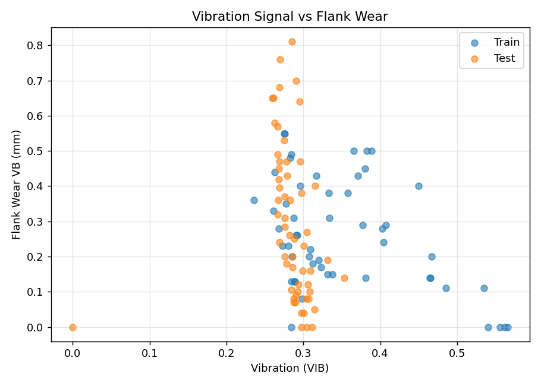
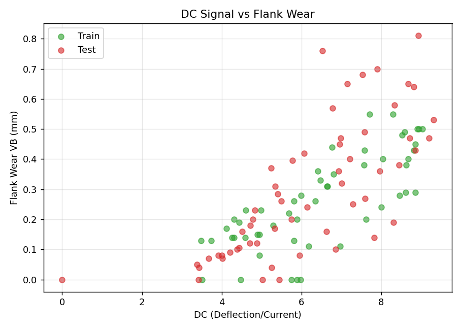
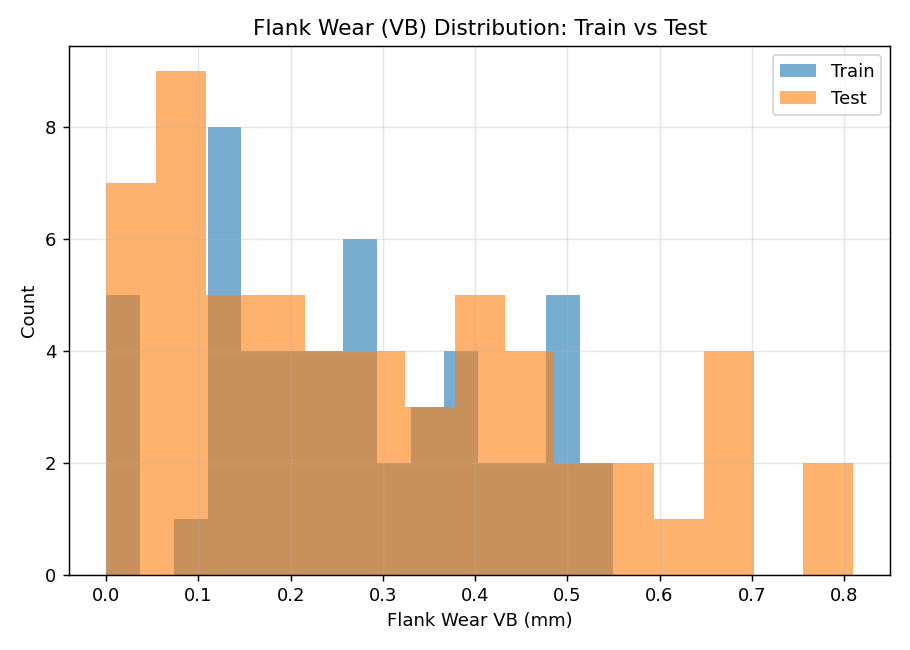

# Predicting Flank Wear in CNC Milling Machines

Regression-based prediction of tool flank wear (VB) in CNC milling, using cutting parameters and in-process sensor signals (vibration, deflection/current) to support proactive maintenance scheduling over reactive tool replacement.

**Course:** Principles of Industrial/Data Analytics (IDA) — IIT Indore
**Supervisor:** Prof. Dr. Vibhor Pandhare
**Team:** 3-member group project (Oct–Nov 2024)

## Overview

Flank wear (VB) on a cutting tool builds up progressively during machining and directly affects surface finish and dimensional accuracy. Predicting VB from indirect signals — rather than measuring it directly, which requires stopping the machine — allows maintenance to be scheduled proactively instead of reactively.

This project builds and validates regression models that predict VB from:
- Cutting parameters: depth of cut (DOC), feed rate, workpiece material
- In-process sensor signals: vibration (VIB), deflection/current (DC)
- Process time

## Data

| File | Description |
|---|---|
| `data/Train_data_3.xlsx` | Training set — cutting parameters, VIB, DC, and measured VB across multiple tool-wear runs |
| `data/Test_data_3.xlsx` | Held-out test set, same schema |
| `data/train_context1.xlsx` | Alternate training split / context variant |
| `data/test_context1.xlsx` | Alternate test split / context variant |

Each row is a single measurement: `case` (run/experiment ID), `run` (observation index), `time`, `DOC`, `feed`, `material`, `VB` (target — flank wear in mm), `VIB` (vibration), `DC` (deflection/current).

## Approach

1. Cleaned and structured the raw sensor logs into train/test sets.
2. Built regression models (MATLAB) mapping cutting parameters + sensor signals → VB.
3. Validated model accuracy using RMSE-based error analysis to guide feature selection and model tuning.
4. Compared predicted vs. actual VB on held-out test data to assess generalization.

## Results

**Predicted vs. actual flank wear (test data):**




**Exploratory analysis:**

Flank wear progresses non-linearly over time and varies by cutting case:



Feature correlations show which signals track most closely with wear:



Vibration and deflection/current both show a positive relationship with wear, supporting their use as predictive features:




Train and test sets cover a similar range of wear values, supporting fair evaluation:



## Repository Structure

```
data/       Raw train/test Excel files
results/    Model output plots and exploratory analysis plots
scripts/    Python script used to generate the exploratory plots
```

## Tech Stack

MATLAB (regression modeling, RMSE validation), Python/Pandas/Matplotlib (exploratory analysis)

## Team Contribution

This was a 3-member team project. My contribution focused on [describe your specific part here — e.g. feature engineering from sensor signals, MATLAB regression modeling, or RMSE-based validation].
